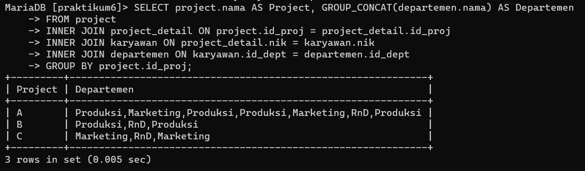
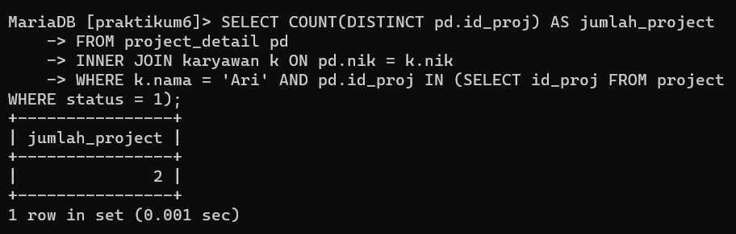

# praktikum6_database

```
Name        : Assandra Julyant Firdausy
ID Number   : 312210384
Class       : TI.22.A.4
```

# **ER-D Karyawan**


## **Input Data**

1. Tabel Perusahaan  
   
2. Tabel Departemen  
   
3. Tabel Karyawan  
   
4. Tabel Project  
   
5. Tabel Project_detail  
   

## **SQL JOIN**

1. Menampilkan Nama Manager tiap Departement  
   **Query**
   ```sql
    SELECT
    d.nama departemen,
    k.nama manajer
    FROM departemen d
    LEFT JOIN karyawan k ON k.nik=d.manajer_nik;
   ```
   **Output**  
   
2. Menampilkan Nama Supervisor tiap karyawan  
   **Query**
   ```sql
    SELECT
    k.nik,
    k.nama,
    d.nama departemen,
    s.nama supervisor
    FROM karyawan k
    LEFT JOIN karyawan s on s.nik=k.sup_nik
    LEFT JOIN departemen d on d.id_dept=k.id_dept;
   ```
   **Output**  
   
3. Menampilkan daftar karyawan yang bekerja pada project A  
   **Query**
   ```sql
    SELECT
    k.nik,
    k.nama
    FROM karyawan k
    JOIN project_detail pj_d ON pj_d.nik=k.nik
    JOIN project pj ON pj.id_proj=pj_d.id_proj
    WHERE pj.nama = 'A';
   ```
   **Output**  
   

## **Latihan Praktikum**

Buat query untuk menampilkan:

1. Departemen apa saja yang terlibat dalam tiap-tiap project  
   **Query**
   ```sql
    SELECT project.nama AS Project, GROUP_CONCAT(departemen.nama) AS Departemen
    FROM project
    INNER JOIN project_detail ON project.id_proj = project_detail.id_proj
    INNER JOIN karyawan ON project_detail.nik = karyawan.nik
    INNER JOIN departemen ON karyawan.id_dept = departemen.id_dept
    GROUP BY project.id_proj;
   ```
   **Output**  
   
2. Jumlah karyawan tiap departemen yang bekerja pada tiap-tiap project  
    **Query**
   ```sql
    SELECT project.nama AS Project, departemen.nama AS Departemen, COUNT(*) AS 'Jumlah Karyawan'
    FROM project
    INNER JOIN project_detail ON project.id_proj = project_detail.id_proj
    INNER JOIN karyawan ON project_detail.nik = karyawan.nik
    INNER JOIN departemen ON karyawan.id_dept = departemen.id_dept
    GROUP BY project.id_proj, departemen.id_dept;
   ```
   **Output**  
    
3. Ada berapa project yang sedang dikerjakan oleh departemen RnD? (ket: project berjalan adalah yang statusnya 1)  
    **Query**
   ```sql
    SELECT COUNT(DISTINCT pd.id_proj) AS jumlah_project
    FROM project_detail pd
    INNER JOIN karyawan k ON pd.nik = k.nik
    INNER JOIN departemen d ON k.id_dept = d.id_dept
    WHERE d.nama = 'RnD' AND pd.id_proj IN (SELECT id_proj FROM project WHERE status = 1);
   ```
   **Output**  
    
4. Berapa banyak project yang sedang dikerjakan oleh Ari?  
    **Query**
   ```sql
    SELECT COUNT(DISTINCT pd.id_proj) AS jumlah_project
    FROM project_detail pd
    INNER JOIN karyawan k ON pd.nik = k.nik
    WHERE k.nama = 'Ari' AND pd.id_proj IN (SELECT id_proj FROM project WHERE status = 1);
   ```
   **Output**  
    
5. Siapa saja yang mengerjakan project B?  
    **Query**
   ```sql
    SELECT k.nik, k.nama
    FROM project_detail pd
    INNER JOIN karyawan k ON pd.nik = k.nik
    WHERE pd.id_proj = 'PJ02';
   ```
   **Output**  
    